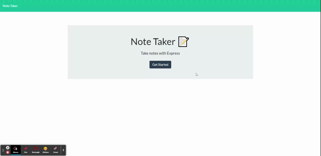

# Note Taker - An application to create, save, and delete notes

## Description
Website that allows a user to create notes as reminders for themselves, then save those notes which are pulled up upon reloading the page. The notes can also be deleted when no longer needed.

## Installation
Follow this link to the deployed site: https://protected-tundra-18198.herokuapp.com/

## Usage
On the home page, click the `Get Started` button to visit the notes page. There, you can create new notes by clicking the `+` button in the upper right corner of the page. After typing a note title and a note description, you can save the note by clicking the save icon in the upper right. The note is then saved and is displayed on the left side of the page. Clicking on one of these saved notes will pull it into the main note area, where upon it can be edited and resaved as a new note. You can also delete notes by clicking on the trash can icon next to the note name. Upon doing so, the note is removed from the list.

## Technologies Used
 - Express.js
 - Jest
 - Node.js
 - Heroku
 - HTML
 - CSS

## Credits

Created following the MSU Coding Bootcamp module on Express.js.
CSS, HTML, and front end JavaScript created by [Xandromus](https://github.com/Xandromus) and [nol166](https://github.com/nol166), while back-end coding using Express.js and Jest done by myself [mfcodingbc](https://github.com/mfcodingbc).

## License

[MIT](https://choosealicense.com/licenses/mit/)